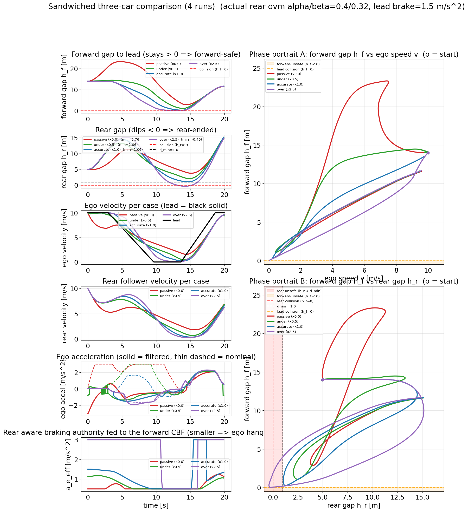
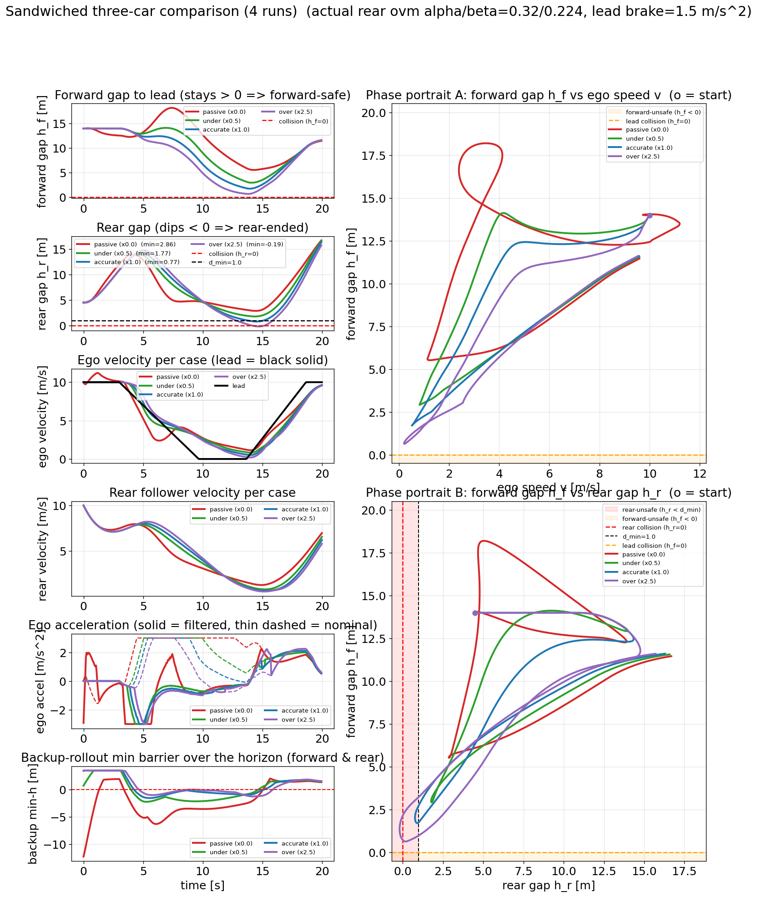
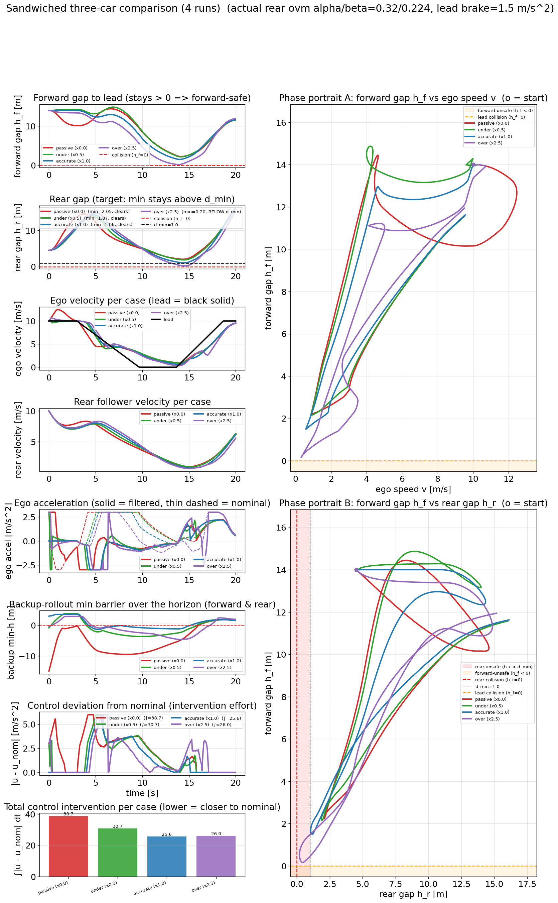
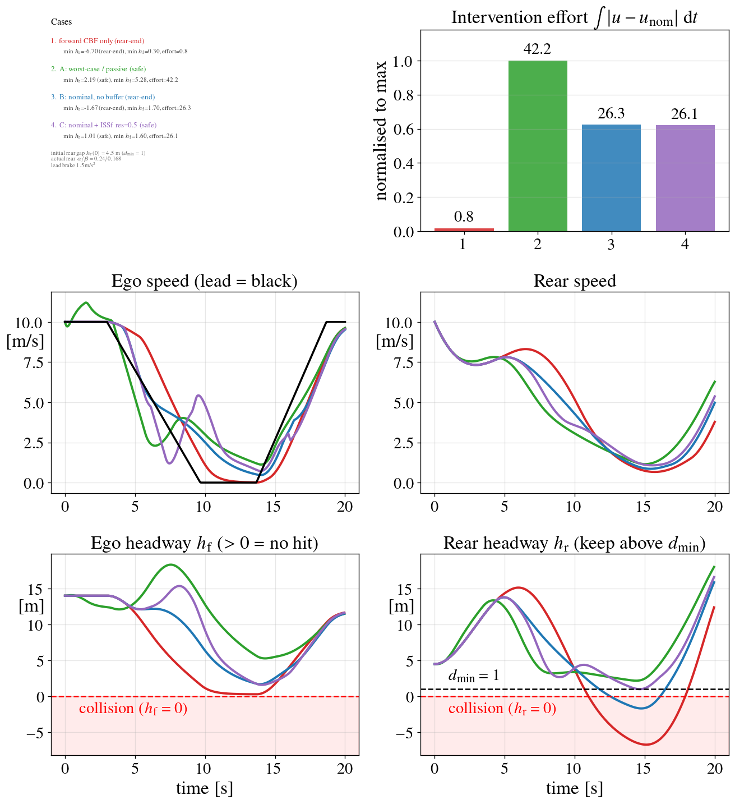
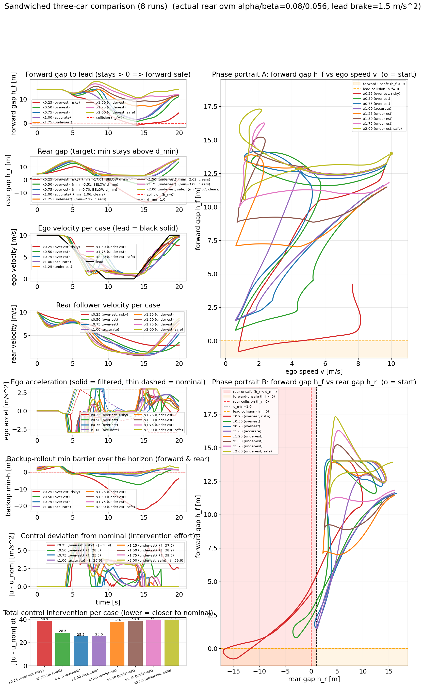
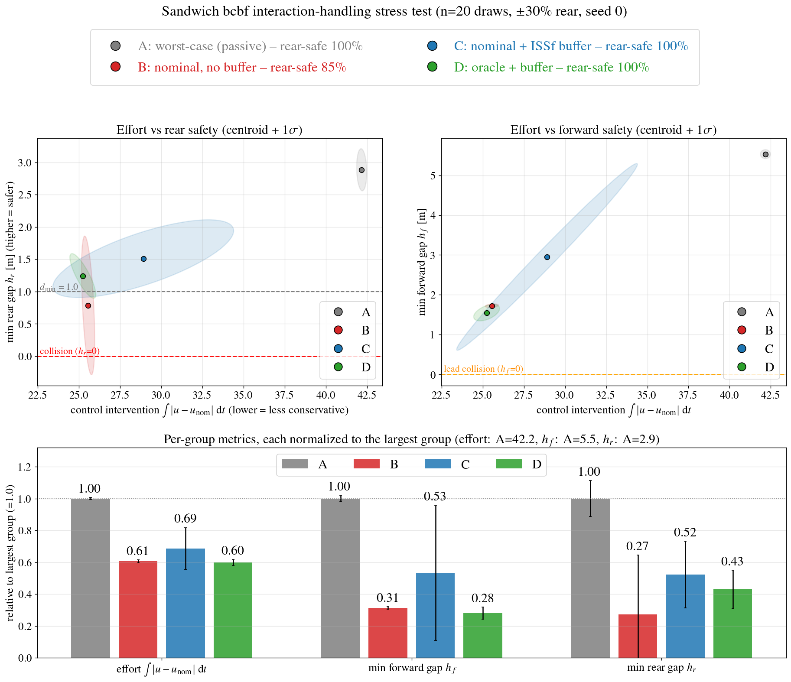

# Rear-Aware Car Following

The ego (an autonomous vehicle) must stay safe with respect to a **lead** ahead
*and* avoid being **rear-ended** by an unfiltered follower behind it. The two
objectives conflict: forward safety wants the ego to brake; rear safety wants it
not to brake too hard (or to pull away). This example builds toward that combined
problem through two simpler 1D scenarios.

Builds on the `car_following` example (reuses its OVM/IDM models, the forward CBF,
and the backup-CBF machinery) and the shared `run_registry.py`.

```
Forward gap  h_f = s_lead - s_ego  - L      (ego follows the lead)
Rear gap     h_r = s_ego  - s_rear - L      (the rear follows the ego)
```
Both must stay >= 0. The rear vehicle has **no safety filter**, so it is not
guaranteed safe — the ego must account for it.

## Scenario 1 — `three_car` (motivates the problem)

`lead (scripted stop-and-go) -> ego (forward CBF) -> rear (OVM follower, no filter)`

The ego runs the forward CBF from `car_following` (safe behind the lead). The rear
is a **steady, sluggish follower**: it cruises at the same speed at its OVM
equilibrium gap (~1.6 s time-gap) with small `alpha`/`beta` (slow reaction). When
the lead stops hard, the ego brakes safely (`h_f >= 0`), but the sluggish rear
reacts too slowly and rear-ends it (`h_r < 0`) — a realistic failure driven by
*reaction lag*, not an artificially close start or a braking limit. No new
controller; it shows the failure mode. `sweep_rear_aware.py --scenario three_car`
scans responsiveness / headway / gap and reports the steady-start rear-end cases.

```bash
uv run python examples/rear_aware/run_three_car.py
# -> ego safe vs lead (min h_f > 0) but rear-ended (min h_r < 0)
```

## Scenario 2 — `ego_rear` (interaction-aware rear safety)

`ego (car-following stop nominal) + rear (OVM follower, no filter)` — no lead. The
ego's nominal brings it to a stop at a target vs a virtual stationary wall (OVM by
default, `--ego-model idm` for IDM); unfiltered, the stop rear-ends the follower.
One simulation runs the ego **three ways** and overlays them:

```bash
uv run python examples/rear_aware/run_ego_rear.py
```

**Ego objective (`--ego-target`).** By default (`stop`) the ego decelerates to the
virtual wall at `--stop-distance`. With `--ego-target speed --v-desired V` the ego instead
performs an arbitrary **target-speed transition** to `V` (no wall): there is no lead, so
the car-following lead-feedback is repurposed for speed regulation — OVM collapses to
`v̇ = (alpha+beta)(V - v)`, IDM to free-road `a(1-(v/V)^4)`. A gentler, non-zero target
generally makes rear-end safety easier to enforce (e.g. easing 9→5 m/s leaves even the
unfiltered baseline safe). Works for both `--ego-model ovm|idm`.

| controller | result | behavior |
|---|---|---|
| baseline (no filter) | `min h_r < 0` REAR-END | stops, is hit |
| backup CBF | `min h_r >= d_min` (sim-safe) | **floors it, abandons the stop** — guarantee is interaction-inconsistent |
| coupled HOCBF | `min h_r >= d_min` (sim-safe) | **brakes gently, rides the boundary** — no formal proof under input constraints |

### Backup CBF (`--method bcbf`)
The backup CBF works in simulation: it keeps `min h_r >= d_min` and the QP is
consistently feasible. The issue is a **soundness gap**, not a mechanical failure.
A backup CBF guarantees "from here, if I commit to the backup maneuver, I stay
safe." That holds for a *passive* obstacle, but the rear is **interactive** — it
reacts to what the ego actually does. The backup rollout assumes the rear reacts to
the ego's *escape*, but the ego applies the *filtered* (near-nominal) control, so
the rear reacts to that instead. The guarantee rests on a reaction the rear never
sees. It also forces an over-aggressive escape (accelerate to `v_max`, abandoning
the stop). Kept as a contrast: it illustrates what guarantee-consistent behavior
looks like when the soundness assumption happens to hold approximately.

### Coupled HOCBF (`--method hocbf`)
Model the rear **in the closed loop**: joint state `[h_r, v_ego, v_rear]` with the
rear's reaction `v̇_rear = a_r(x)` part of the dynamics, and constrain the *applied*
ego acceleration. `b = h_r - d_min` has relative degree 2, so a high-order CBF gives
a single analytic lower bound on the ego acceleration:
```
a >= a_r(x) - (alpha1 + alpha2)(v_ego - v_rear) - alpha1*alpha2*(h_r - d_min)
```
`a_r(x)` is the rear's reaction at the *actual* state (no counterfactual), so it is
interaction-consistent. The ego simply **limits its braking** so the rear can keep
pace — it rides `h_r = d_min` and still stops (a little past the target), rather
than escaping. No rollout, no QP. Gains `--hocbf-a1`, `--hocbf-a2`.

**Caveat:** this is not a formally verified CBF. Standard HOCBF validity requires
that the input constraint set (`a ∈ [a_min, a_max]`) is compatible with the
lower-bound condition everywhere on `{b >= 0}`. When the required lower bound
exceeds `a_max` (reported as `'infeasible'` in `results.json`), the condition cannot
be met and safety is not guaranteed by the theory. In practice the constraint is
rarely active at its limit, but no formal proof of forward invariance under input
saturation has been established here.

### Robustness to rear-model mismatch (`--hocbf-robust-factor`)
The HOCBF uses the ego's *assumed* rear model; the actual rear may be less
responsive. `--hocbf-robust-factor r` (in `(0,1]`) evaluates the worst-case rear
reaction with response gains scaled by `r` (the rear may brake *less* than
assumed), giving a more conservative bound. Demonstrated mismatch (actual
`alpha=beta=0.3`, HOCBF assumes `0.6/0.4`): the deterministic HOCBF (`r=1`) breaches
the margin (`min h_r ≈ 0.39 < d_min`), while `r=0.5` holds it (`min h_r ≈ 1.0`).
Assumed params are also configurable directly (`--assumed-rear-alpha/-beta/-kappa/
-a-decel`), as is the assumed model *type* (`--assumed-rear-model {ovm,idm}`,
default = actual). E.g. assuming IDM when the rear is actually OVM drops the HOCBF
margin (`min h_r` 1.0 -> 0.23 in the default case) — visible as `mismatch=True` in
`register.csv`.

### Backup-CBF details (contrast controller)
Accelerate-to-`v_max` escape flow, rollout safety `h_r(t) >= d_min`, terminal =
positive gap at the horizon. Because the rear **reacts to the ego**, the plant is
**augmented** to the joint state `[s_e, v_e, s_r, v_r]` with the rear's assumed reaction
`a_rear(x)` folded into the drift (`x_dot = f(x) + g(x) u`, `f = [v_e, 0, v_r, a_rear(x)]`,
`g = [0, 1, 0, 0]`). The backup flow and its **sensitivity matrix** `S_i = dφ_i/dx0` then
come from the framework's own `BackupCBF._integrate_backup_trajectory`
(`position_control/backup_cbf_qp.py`) — a rigorous flow STM, not an end-to-end barrier
finite difference — and the QP uses `∇h·S·g0 / ∇h·S·f0` with `∇h = [1,0,-1,0]` (no `dh/dt`,
since the rear is a state, not an exogenous obstacle). It keeps `h_r >= 0` because the
escape is robust — but, per above, the *guarantee* is unsound for an interacting rear.
(Contrast: the forward `car_following` CBF stays a 2-state ego with an analytical STM,
because the lead is exogenous and never enters the dynamics.)

The terminal (gap-at-horizon) constraint and its gain are configurable:
`--gamma-terminal G` sets the terminal class-K gain, and `--backup-terminal` /
`--no-backup-terminal` includes or drops the terminal constraint. 
There are known issue with infeasibility at the terminal state due to in sufficient
yet hard to determined preview horizon. Can choose to drop it but better supply long
enough horizon.
ego_rear **drops it by default** (`--no-backup-terminal`); pass
`--backup-terminal` to restore it. The `RearEndBackupCBF1D(use_terminal=...)` class
default keeps the terminal.

### Interaction-model accuracy matters (preliminary study)

How much does the **accuracy** of the ego's assumed rear-following model matter to the backup
CBF? Using target-speed mode (ego eases `9 → 1` m/s; actual rear OVM `α=0.4, β=0.3`), we sweep
the *assumed* rear responsiveness as a scale of the actual gains — `passive (0)` → `under (<1)`
→ `accurate (1)` → `over (>1)` — and measure both safety (`min h_r`) and performance.

Two findings:

1. **Safety is structurally robust to mismatch.** Every filtered run stays safe
   (`min h_r ≈ 2.1–2.6 ≫ d_min`) for *every* assumed model — even 2× over-estimation. With no
   lead, the ego always retains a **forward escape** (accelerate to `v_max > v_road`), so
   over-trusting the rear's braking never causes a collision: the QP re-solves each step and
   falls back on the escape. **Over-estimation is not punished here.**
2. **Mismatch shows up as performance, not a safety cliff.** A conservative assumption
   (passive / under-responsive) makes the ego hold more speed — it settles to `v_desired`
   slowly or never, with a larger steady offset and much heavier filter intervention. A more
   accurate / responsive assumption settles faster and overrides the driver less.

| assumed (scale) | `min h_r` | `t_settle` [s] | `v_offset` | intervention | outcome |
|---|---|---|---|---|---|
| baseline (no filter) | **−1.61** | 3.6 | 0.0 | 0 | **rear-end** |
| passive (0) | 2.58 | never | 0.58 | 23.0 | safe, poor perf |
| under (0.5) | 2.39 | 13.3 | 0.40 | 17.2 | safe |
| accurate (1.0) | 2.27 | 10.2 | 0.27 | 13.7 | safe |
| over (2.0) | 2.11 | 8.2 | 0.11 | 9.6 | safe |

(`t_settle` to `|v−v_desired| ≤ 0.5`; `v_offset = v_final − v_desired`; intervention `= ∫|u−u_nom| dt`.
The actual and assumed `α, β` are logged per run in `register.csv`.)

**Takeaway.** The no-lead `ego_rear` scenario demonstrates three of the four interaction
regimes — *no safety → crash; conservative model → safe but poor task performance; accurate
model → best performance* — but **not** "over-estimate → collision", because the forward escape
is always available. Punishing over-estimation needs the ego **sandwiched** by a lead in front
(the combined three-car scenario; see *Combined front + rear* below).

**Reproduce** (the sweeps default to gitignored `temp_<scenario>/` folders; the saved copies
under `saved_results/` were produced by these same commands and then moved):
```bash
# 1. find a non-degenerate operating point (baseline crashes, accurate settles);
#    sweeps ego_v0 x v_desired x v_max  ->  temp_v_regime/sweep_v_regime.csv
uv run python examples/rear_aware/sweep_rear_aware.py --scenario v_regime

# 2. at the chosen operating point, sweep the assumed/actual responsiveness scale (+ perf
#    metrics)  ->  temp_interaction_accuracy/sweep_interaction_accuracy.csv
uv run python examples/rear_aware/sweep_rear_aware.py --scenario interaction_accuracy

# 3. statistics figure (safety flat; t_settle / v_offset / intervention degrade)
uv run python examples/rear_aware/plot_accuracy_sweep.py \
    examples/rear_aware/temp_interaction_accuracy/sweep_interaction_accuracy.csv

# 4. the five representative full runs (one --method per invocation) into temp_representative/
#    operating point: ego eases 9 -> 1 m/s, actual rear OVM alpha=0.4 beta=0.3
COMMON="--tf 25 --ego-v0 9 --v-desired 1.0 --v-max 14 --v-road 12 --gap-r0 3 --d-min 1 \
        --u-acc 3 --rear-alpha 0.4 --rear-beta 0.3 --output-dir examples/rear_aware/temp_representative"
uv run python examples/rear_aware/run_ego_rear.py --method baseline $COMMON                                       # run_001
uv run python examples/rear_aware/run_ego_rear.py --method bcbf --assumed-rear-alpha 0.0 --assumed-rear-beta 0.0  $COMMON  # passive  run_002
uv run python examples/rear_aware/run_ego_rear.py --method bcbf --assumed-rear-alpha 0.2 --assumed-rear-beta 0.15 $COMMON  # under    run_003
uv run python examples/rear_aware/run_ego_rear.py --method bcbf                                                   $COMMON  # accurate run_004
uv run python examples/rear_aware/run_ego_rear.py --method bcbf --assumed-rear-alpha 0.8 --assumed-rear-beta 0.6  $COMMON  # over     run_005

# 5. behavior overlay from a JSON spec listing those five run folders (see
#    saved_results/ego_rear_interactive_compare/compare_spec.json for the exact spec)
uv run python examples/rear_aware/plot_runs.py examples/rear_aware/temp_representative/compare_spec.json
```

**Saved results:** the statistics sweep
[`ego_rear_interaction_accuracy_stats/`](saved_results/ego_rear_interaction_accuracy_stats/)
(`accuracy_sweep.png` + CSV) and the five-run behavior overlay
[`ego_rear_interactive_compare/`](saved_results/ego_rear_interactive_compare/)
(`compare_runs.png`, from `compare_spec.json`). Both — with their reproduce commands — are indexed
in the [Saved results catalog](#saved-results-catalog) below.

## Scenario 3 — `sandwich` (combined front + rear)

The ego **between** a lead and a follower, enforcing `h_f >= 0` (don't hit the lead) and
`h_r >= 0` (don't get rear-ended) together. Because the ego **cannot escape forward**, this is the
scenario where **interaction-model accuracy decides *safety*** — unlike the no-lead `ego_rear`
above, where the forward escape makes the filter robust to mismatch and only *performance*
degrades. The ego nominal is deliberately aggressive (tailgating; brakes late/hard). Two
controllers solve it (an analytic HOCBF and a backup CBF), plus an ISSf robustness margin and a
Monte-Carlo stress test. Driver: `run_sandwich.py --method {sandwiched_hocbf,sandwiched_bcbf}`.

> A naive front-ceiling / rear-floor clip is **not** enough: the rear floor only limits braking
> *reactively*, so the ego tailgates to the forward boundary and then brakes hard *regardless of
> the rear model* — accurate and over-estimate rear-end identically. The fix in both controllers
> is to make the ego **proactively hang back** by an amount that depends on the assumed rear.

### Stage A — analytic HOCBF (`sandwiched_cbf.py`, `--method sandwiched_hocbf`)

Forward CBF vs the lead + coupled rear HOCBF (ego's *assumed* rear model), resolved
**forward-first**. The key coupling is `a_e_eff` — the largest ego deceleration for which the
assumed rear keeps `h_r >= d_min` — fed into the forward safe-distance, so the ego hangs back
proactively. Accurate (sluggish) rear → small `a_e_eff` → larger forward gap → safe; over-estimate
→ tailgates → the real sluggish rear is hit.
Reproduce: [`reproduce_sandwich_hocbf.sh`](reproduce_sandwich_hocbf.sh) →
[`saved_results/sandwich_hocbf/`](saved_results/sandwich_hocbf/) (actual rear OVM `α/β = 0.40/0.32`;
only the *assumed* rear is swept).

| assumed (scale) | min h_f | min h_r | outcome |
|---|---|---|---|
| passive (×0) | 2.86 | 3.76 | safe (over-cautious) |
| under (×0.5) | 1.07 | 2.06 | safe |
| **accurate (×1)** | 0.23 | **1.06** | **safe both** |
| over (×2.5) | 0.03 | **−0.40** | **rear-end** (still forward-safe) |



### Stage B — backup CBF, an alternative to the HOCBF (`sandwiched_bcbf.py`, `--method sandwiched_bcbf`)

A **different CBF** for the same sandwich: a backup CBF instead of the analytic HOCBF. Escaping to
`v_max` is impossible (the lead blocks the ego), so the backup policy is a **rear-aware
car-following OVM** — follow the lead but brake *less* when the rear is catching up
(`+ β_f (v_rear − v_ego)`). The 4-state augmented plant `[s_e,v_e,s_r,v_r]` gives a rigorous flow
STM; forward & rear barriers are imposed along the rollout, forward-priority.

This baseline ([`saved_results/sandwich_bcbf/`](saved_results/sandwich_bcbf/) run_001–004) carries
**no robustness-to-mismatch (ISSf) consideration yet** — it is the plain backup CBF. But because
the backup's gentleness depends on the *assumed* rear, sweeping that assumed parameter already
**previews** the accuracy-decides-safety reaction (actual rear fixed at `0.32/0.224`, assumed swept
passive → over): accurate is safe but **grazes `d_min`** (`min h_r = 0.77`) and the over-estimate
**rear-ends** (`−0.19`) — exactly mirroring Stage A's HOCBF.

| assumed (scale) | min h_f | min h_r | outcome |
|---|---|---|---|
| passive (×0) | 5.52 | 2.86 | safe (over-cautious) |
| under (×0.5) | 2.92 | 1.77 | safe |
| accurate (×1) | 1.71 | **0.77** | safe but grazes `d_min` |
| over (×2.5) | 0.63 | **−0.19** | **rear-end** |



### Stage B+ — ISSf rear margin (`saved_results/sandwich_bcbf/` run_005–008) — fix real rear, vary the *belief* rear
Now add interaction-error robustness: inflate the **rear** barrier by a mismatch-proportional
buffer `L_inter·(|Δα|+|Δβ|) + residue` (opt-in `--l-inter-ratio`, `--l-inter-residue`), promoted so
it actually shapes the brake (`--rho-rear`, with a firmer class-K gain `--gamma`). Same assumed-rear
sweep, same fixed actual `0.32/0.224`. The margin pulls the over-estimate case from a hard rear-end
(`−0.19`) up to **collision-free** (`+0.20`) — though the physical sandwich keeps it from fully
restoring the `d_min` comfort margin (that would require hitting the lead).

| assumed (scale) | baseline `min h_r` | **ISSf** `min h_r` |
|---|---|---|
| passive (×0) | 2.86 | 2.05 |
| under (×0.5) | 1.77 | 1.87 |
| accurate (×1) | 0.77 | 1.06 |
| over (×2.5) | **−0.19** (rear-end) | **+0.20** (collision-free) |



Both stages are reproduced by [`reproduce_sandwich_bcbf.sh`](reproduce_sandwich_bcbf.sh).

#### Parameter variations across the backup-CBF experiments

The operating point was **re-tuned** as the study progressed. The three ISSf experiments below
share the *same* ISSf gains (`L_inter = 4.0`, `residue = 0.5`, `ρ_rear = 3e4`) but differ in what is
held fixed vs. swept; the class-K gain `γ` was raised **`1.0 → 2.0`** when the ISSf margin was
introduced (the promoted rear constraint needs a firmer gain to bite) and stayed `2.0` thereafter.
Nominal rear `0.32/0.224`, `κ = 0.7`, `a_e = 2.5`, lead brake `1.5` throughout.

| experiment | assumed rear (belief) | real rear (actual) | `γ` | ISSf gains |
|---|---|---|---|---|
| baseline — `sandwich_bcbf` run_001–004 | **swept** `0/0 → 0.8/0.56` | fixed `0.32/0.224` | 1.0 | none |
| ISSf — `sandwich_bcbf` run_005–008 | **swept** `0/0 → 0.8/0.56` | fixed `0.32/0.224` | 2.0 | 4.0, 0.5, 3e4 |
| mirror sweep — `sandwich_bcbf_rear_sweep` | fixed `0.32/0.224` | **swept** `×0.25 → ×2.0` | 2.0 | 4.0, 0.5, 3e4 |
| stress — `sandwich_bcbf_stress` | per-strategy¹ | **random** `±30%` of nominal | 2.0 | 4.0, 0.5, 3e4 |

¹ Stress strategies: **A** assumes passive `0/0`; **B** & **C** assume nominal `0.32/0.224`; **D**
assumes the actual rear (oracle).

### Motivating example — four ways to handle the rear at one operating point

To make the trade-off concrete, fix a single scenario — a slightly-sluggish **real** rear
(`α/β = 0.24/0.168`, i.e. ×0.75 of the `0.32/0.224` the ego *believes*) behind the aggressive ego
nominal and the mild (`1.5`) lead brake — and compare four controllers
([`saved_results/sandwich_story/`](saved_results/sandwich_story/)):

| controller | min h_f | min h_r | ∫\|u−u_nom\| | outcome |
|---|---|---|---|---|
| **forward CBF only** (`--method forward_only`, no rear awareness) | 0.30 | **−6.70** | 0.8 | forward-safe but **slams the rear** |
| **A** — worst-case (assume rear passive `0/0`) | 5.3 | 2.19 | 42.2 | safe, but ~1.7× over-conservative |
| **B** — nominal belief, no buffer | 1.7 | **−1.67** | 26.3 | **rear-ends** (over-trusts the real rear) |
| **C** — nominal belief + ISSf buffer (residue 0.5) | 1.6 | 0.70 | 25.3 | **safe** (collision-free), cheapest |



**The scenario starts the rear *tight*.** The initial rear gap is `h_r(0) = 4.5 m` — only a few
metres above the `d_min = 1 m` comfort margin — so the rear vehicle begins almost on the ego's
bumper. With so little slack, every controller's first job is to let the gap *open*: across all four
cases `h_r` rises out of the tight start over the first few seconds before the lead-brake event
squeezes it again. That early opening is also what makes the interaction *observable* — the rear's
response to the ego is what reveals its true responsiveness, so the gap has to breathe before any
`(α, β)` estimate (or the ISSf mismatch term) means anything.

**A's early "sprint" is the backup CBF reacting to the worst-case rear.** Case A assumes a *passive*
rear (`α = β = 0`), which in the OVM `a_rear = α(V_h−v) + β(W−v)` means the assumed rear **coasts at
constant speed and never brakes**. Its backup rollout therefore predicts that if the ego brakes for
the lead, this never-yielding tail closes the (already tight) gap and rear-ends it — so the
backup-CBF QP pushes the ego control *above* nominal to **accelerate and open the rear gap
proactively**, while the forward gap is still large. That is the green speed bump above the lead's
10 m/s in the first ~1.5 s: A spends forward margin to bank rear margin against an imagined
non-braking tailgater. It is exactly this conservatism that makes A safe-but-expensive (effort 42
vs ~26 for B/C). The *real* rear here is merely sluggish (not malicious), so A over-pays; B trusts
the nominal model and rear-ends when the real rear turns out slower than believed; only the ISSf
buffer **C is both safe and least conservative** (cheaper even than the crashing B).

The forward-only baseline (a permanent `run_sandwich.py --method forward_only`, run on the *same*
scenario as A/B/C — not the off-regime default `run_three_car`) does almost nothing for the rear
and is demolished.

**Sizing the buffer.** C's buffer is `L_inter·(|Δα|+|Δβ|) + residue`. Sweeping it at this (hardest)
operating point shows `min h_r` tracks the **total buffer** almost perfectly, *independent of how it
is split* between the oracle mismatch term and the fixed residue:

| `L_inter` / `residue` | total buffer [m] | min h_r | clears `d_min` |
|---|---|---|---|
| 4 / 0.5 | 1.04 | 0.70 | ✗ |
| 4 / 0.75  (≈ 6 / 0.5) | ~1.3 | 0.85 | ✗ |
| **4 / 1.0  (≈ 8 / 0.5)** | **~1.55** | **1.00** | **✓** |

Clearing the `d_min` comfort margin here needs **≈ 1.55 m of buffer however you split it**. Since
the mismatch term is an *oracle* (it needs the true rear, unavailable in deployment), the **residue
is the only part you can actually budget** — `L_inter` vs `residue` is a modeling preference, not a
performance lever. The C variants (residue 0.5 / 0.75 / 1.0, and `L_inter` 6 / 8) are saved as
`run_004 … run_008` with overlay figures `compare_story_issf{075,100}.png`.

### Mirror sweep — fix belief, vary the *real* rear

Pin the ego's belief at `0.32/0.224` and vary the **real** rear `×0.25 … ×2.0` (the ISSf buffer
auto-adapts to the realized mismatch). Effort is U-shaped (cheapest at accurate); the
under-estimate side (real rear *more* responsive than believed) is always safe but costly, while
the extreme over-estimate (`×0.25`, a near-unbraking rear) is unrecoverable — rear-end `−17` and
even a forward graze — the limit of the reactive rear lever (an uncontrolled rear that won't brake
cannot be saved by the ego alone). Same script as Stage B →
[`saved_results/sandwich_bcbf_rear_sweep/`](saved_results/sandwich_bcbf_rear_sweep/).



Remark: the ISSf sweep and the mirror sweep coincide **only at the accurate case** —
[`sandwich_bcbf/run_007`](saved_results/sandwich_bcbf/run_007) (ISSf, accurate) and
[`sandwich_bcbf_rear_sweep/run_004`](saved_results/sandwich_bcbf_rear_sweep/run_004) both have
belief = actual = nominal `0.32/0.224`, so they are the *identical* config (same fingerprint, same
results). Runs at the **same scale otherwise differ**, because the two sweeps move in opposite
mismatch directions: scaling the *actual* while fixing the belief (mirror sweep) at e.g. ×0.5 is
**over**-estimation (real rear sluggish than believed), whereas scaling the *belief* while fixing
the actual (ISSf sweep) at ×0.5 is **under**-estimation.

### Stress test — 4 strategies, randomized rear (`stress_test_sandwich.py`) — vary the *real* rear, belief differs per strategy

Randomize the real rear `±30%` around nominal (20 paired draws) and compare four ways of handling
the interaction: **A** worst-case (assume passive), **B** nominal belief no buffer, **C** nominal +
ISSf buffer, **D** oracle (assume the actual rear) + buffer. The groups cluster in distinct regions
of the (intervention-effort, `min h_r`) plane →
[`saved_results/sandwich_bcbf_stress/`](saved_results/sandwich_bcbf_stress/) (`raw/` + `aggregated/`
saved separately; the figure is built from the aggregated JSON alone).

| group | effort | collision-free | clears `d_min` |
|---|---|---|---|
| A worst-case (passive) | 42 | 100% | 100% (very conservative) |
| B nominal, no buffer | 26 | **85%** | 55% |
| C nominal + ISSf | 29 | **100%** | 80% |
| D oracle + ISSf | 25 | **100%** | 80% |

C and D are safe (no collision) at far lower effort than the conservative A; B is cheap but unsafe
~15% of the time. D's `d_min` honoring is driven only by `l_inter_residue` (its mismatch ≈ 0);
raising the residue lifts both toward 100% clears-`d_min`. Run with `--jobs N` to parallelize and
`--no-latex` to disable the Times/LaTeX paper styling.



## Saved results catalog

Every saved set under `saved_results/` was produced by the linked script and then moved there
(the scripts default to gitignored `output/` / `temp_*/`). Each `run_NNN/` holds a `config.json`
(pruned to the method's params), a `series_*.npz` (re-plottable without re-simulating), and a
`results.json` (min `h_f`/`h_r`, safety flags, solver stats).

| folder | setup | reproduce | figure(s) |
|---|---|---|---|
| [`ego_rear/`](saved_results/ego_rear/) | Scenario 2 method comparison + terminal/robust ablations (run_001–006) | [`reproduce_ego_rear.sh`](reproduce_ego_rear.sh) §A | `compare_baseline_bcbf_hocbf.png`, `compare_bcbf_terminal_constraints.png`, `compare_hocbf_robust.png` |
| [`ego_rear_interactive_compare/`](saved_results/ego_rear_interactive_compare/) | Scenario 2 assumed-accuracy overlay: baseline + passive/under/accurate/over (run_001–005) | [`reproduce_ego_rear.sh`](reproduce_ego_rear.sh) §B | `compare_runs.png` + per-run `ego_rear.png` |
| [`ego_rear_interaction_accuracy_stats/`](saved_results/ego_rear_interaction_accuracy_stats/) | Scenario 2 accuracy-statistics sweep (safety flat, performance degrades) | [`reproduce_ego_rear.sh`](reproduce_ego_rear.sh) §C | `accuracy_sweep.png` (+ CSV) |
| [`sandwich_hocbf/`](saved_results/sandwich_hocbf/) | Stage A HOCBF, assumed-rear sweep (run_001–004) | [`reproduce_sandwich_hocbf.sh`](reproduce_sandwich_hocbf.sh) | `compare_sandwich.png`, `compare_hf_hr_aee.png` |
| [`sandwich_bcbf/`](saved_results/sandwich_bcbf/) | Stage B backup CBF — baseline (run_001–004) + ISSf margin (run_005–008) | [`reproduce_sandwich_bcbf.sh`](reproduce_sandwich_bcbf.sh) | `compare_sandwich.png`, `compare_issf.png` |
| [`sandwich_bcbf_rear_sweep/`](saved_results/sandwich_bcbf_rear_sweep/) | Stage B fix-belief / vary-real-rear ×0.25–2.0 (run_001–008) | [`reproduce_sandwich_bcbf.sh`](reproduce_sandwich_bcbf.sh) | `compare_rear_sweep.png` |
| [`sandwich_bcbf_stress/`](saved_results/sandwich_bcbf_stress/) | 4-strategy Monte-Carlo stress test (n=20, ±30% rear) | [`stress_test_sandwich.py`](stress_test_sandwich.py) | `stress_clusters.png` (+ `raw/`, `aggregated/`) |
| [`sandwich_story/`](saved_results/sandwich_story/) | Motivating example at one operating point: forward-only vs A/B/C + buffer-sizing variants (run_001–008) | `run_sandwich.py --method forward_only` / `sandwiched_bcbf` | `compare_story.png` (+ `compare_story_issf{075,100}.png`) |

## Running individual methods, saved data, and comparison plots

`run_ego_rear.py` runs **one** controller per invocation, chosen with `--method`
(default `hocbf`):

```bash
uv run python examples/rear_aware/run_ego_rear.py --method baseline
uv run python examples/rear_aware/run_ego_rear.py --method bcbf
uv run python examples/rear_aware/run_ego_rear.py --method hocbf
```

The method is part of the run's config — so each is its own registry entry — and its
`config.json` records **only the parameters that method uses** (e.g. a `bcbf` run stores
the backup gains/horizon; a `hocbf` run stores the HOCBF gains; `baseline` stores neither
and no assumed-rear model). Every run **saves its time-series** to
`<run_dir>/series_<method>.npz` (`run_three_car.py` saves `series_three_car.npz`) so runs
can be re-plotted without re-simulating.

**`plot_runs.py`** is an independent comparison plotter driven by a minimal JSON spec — a
`runs` map of `{"run-name": "path"}` (each key the label, each value the run folder) plus an
optional `output` figure path (see `compare_spec.example.json`):

```bash
uv run python examples/rear_aware/plot_runs.py examples/rear_aware/compare_spec.example.json
```

```json
{
  "output": "output/compare_methods.png",
  "runs": {
    "baseline": "output/run_001",
    "backup CBF": "output/run_002",
    "HOCBF": "output/run_003"
  }
}
```

A bare `{"run-name": "path"}` object (no `runs`/`output` wrapper) is still accepted as the
runs map. Relative run paths are resolved by trying the example directory
(`examples/rear_aware`), then the spec file's directory, then the cwd — the first holding a
`series_*.npz` wins — so paths written relative to the example dir (e.g.
`saved_results/ego_rear/run_001`) or beside the spec both work. The single `series_*.npz`
in each run folder is loaded automatically. The figure has a fixed layout —
a left column of three time series (rear gap `h_r` with `h_r=0`/`d_min` dashed; ego velocity
with the target speed dashed; ego acceleration as solid actual + thin dashed nominal in the
same colour) and a right-hand **phase portrait** (ego speed `v` on the y-axis vs rear gap
`h_r` on the x-axis) overlaying the desired-speed line, vertical `h=0` and `h=d_min` lines
with the unsafe `h<d_min` region shaded red, and the rear's range-policy curve (OVM or IDM,
whichever the rear model in use is). Reference values (`d_min`, target speed, rear params)
are read from the first run's `config.json`. The output path is the spec's `output`,
overridden by `--output` when supplied, else `<spec_dir>/compare_runs.png`.

It also prints a **config-difference table** read directly from each run's `config.json`
(the full pruned config, unlike `register.csv` which keeps only a few key columns): keys
identical across all runs are hidden, and a key absent from a run's config shows as `-`.

## Parameter sweep

Finding representative cases needs tuning. `sweep_rear_aware.py` runs a grid
(metrics only, no figures) and prints the cases worth rendering, writing a summary
CSV to `output/sweep_<scenario>.csv`.

```bash
uv run python examples/rear_aware/sweep_rear_aware.py --scenario three_car   # cases that rear-end
uv run python examples/rear_aware/sweep_rear_aware.py --scenario ego_rear     # cases the filter saves
uv run python examples/rear_aware/sweep_rear_aware.py --scenario v_regime              # find an operating point (ego_v0 x v_desired x v_max)
uv run python examples/rear_aware/sweep_rear_aware.py --scenario interaction_accuracy  # assumed-vs-actual rear responsiveness (+ perf metrics)
```
The `v_regime` and `interaction_accuracy` sweeps back the *interaction-model accuracy* study
above; they default their output to a gitignored `temp_<scenario>/` folder.
Render a chosen case with the matching `run_three_car.py` / `run_ego_rear.py`
flags; each run is a registry entry under `output/run_NNN/` (dedup by config; see
`examples/README.md`). On a config that already exists, `--force` recomputes it into a
**new** `run_NNN` (keeping the duplicate) while `--override` **overwrites the existing**
`run_NNN` in place (no duplicate folder or register row). Use `--output-dir <path>` on any
of these scripts to write the results (figures, configs, `register.csv`) somewhere other
than the default `<example>/output`.

## Known limitations / TODO
- **HOCBF validity under input constraints.** The coupled HOCBF lower-bound condition
  is not always satisfiable when `a_min` is bounded (vehicle cannot decelerate
  arbitrarily hard). When the required lower bound exceeds the acceleration limit,
  the filter saturates and formal safety is not guaranteed. Infeasible steps are
  counted in `results.json`. A formally valid approach would require verifying
  compatibility of the input set with the HOCBF condition on all of `{b >= 0}`.
- **HOCBF needs a rear model.** The coupled HOCBF assumes a (bounded) model of the
  rear's reaction. `--hocbf-robust-factor` hedges against under-responsiveness, but a
  fully adversarial tailgater cannot be guaranteed against by any ego controller —
  an RSS-style "not at fault" framing is the honest fallback there.
- **Backup CBF, escape-to-`v_max` (Scenario 2 only — rear-only, no lead).** The `ego_rear`
  backup CBF (`RearEndBackupCBF1D`) works in simulation (keeps `min h_r >= d_min`, QP consistently
  feasible), but its safety *guarantee* is interaction-inconsistent: the backup rollout assumes the
  rear reacts to the ego's **escape (accelerate to `v_max`)**, while the ego actually applies the
  filtered (near-nominal) control, so the rear reacts to that instead. It also has a
  `v_max`-saturation chatter degeneracy worked around by keeping the escape `v_max` above road
  speed. Both are artifacts of the *escape* maneuver, which only exists with no lead. The
  **Scenario 3 sandwich** backup CBF (`SandwichedBackupCBF1D`) cannot escape forward, so it uses a
  rear-aware *follow-lead* backup instead — its open issue is rear-model **mismatch** (the ISSf
  margin and its reactive-limit caveat above), not this escape inconsistency.
- **Combined front + rear (Scenario 3, `sandwich`).** Solved two ways — an analytic HOCBF
  (`a_e_eff` coupling) and a backup CBF (rear-aware OVM backup) — both making the ego
  *proactively hang back* so accuracy decides safety. An opt-in **ISSf rear margin** robustifies
  the backup CBF against rear-model mismatch, and a 4-strategy stress test quantifies it. Residual
  limit: the *reactive* rear margin cannot rescue an extreme over-estimate (a near-unbraking real
  rear) without hitting the lead — that case is physically unrecoverable for the ego alone.

## Files
| File | Role |
|------|------|
| `run_three_car.py` | Scenario 1 (three-car): simulation, figure, registry, saved series |
| `run_sandwich.py` | Scenario 3 (sandwich): `--method {sandwiched_hocbf,sandwiched_bcbf}` combined front+rear ego |
| `sandwiched_cbf.py` | `SandwichedHOCBF` — Stage A: forward CBF + coupled rear HOCBF (`a_e_eff` coupling) |
| `sandwiched_bcbf.py` | `SandwichedBackupCBF1D` — Stage B: rear-aware OVM backup CBF + ISSf rear margin |
| `plot_sandwich_cases.py` | overlay/compare saved sandwich runs (forward+rear gaps + phase portraits) |
| `stress_test_sandwich.py` | 4-strategy Monte-Carlo stress test (`--jobs`, `--no-latex`); raw + aggregated + cluster figure |
| `reproduce_*.sh` | one-shot scripts that regenerate each `saved_results/` set (ego_rear / sandwich_hocbf / sandwich_bcbf) |
| `run_ego_rear.py` | Scenario 2 (ego + rear): one `--method` (baseline/bcbf/hocbf) per run, figure, registry, saved series |
| `plot_runs.py` | independent comparison plotter (overlay saved runs via a JSON spec) |
| `plot_accuracy_sweep.py` | statistics plotter for the `interaction_accuracy` sweep CSV |
| `compare_spec.example.json` | example spec for `plot_runs.py` |
| `rear_aware_common.py` | shared constants, matplotlib, registry/figure + series save/load helpers |
| `coupled_rear_cbf.py` | `CoupledRearCBF` — interaction-consistent HOCBF (recommended) |
| `rear_backup_cbf.py` | `RearEndBackupCBF1D` — accelerate-to-escape backup CBF (contrast) |
| `rear_aware_models.py` | ego OVM-to-stop nominal + rear follower helpers |
| `sweep_rear_aware.py` | parameter sweep -> representative cases + CSV |
| `../car_following/` | reused models, forward CBF, backup-CBF base |
| `../run_registry.py` | shared run registry |
